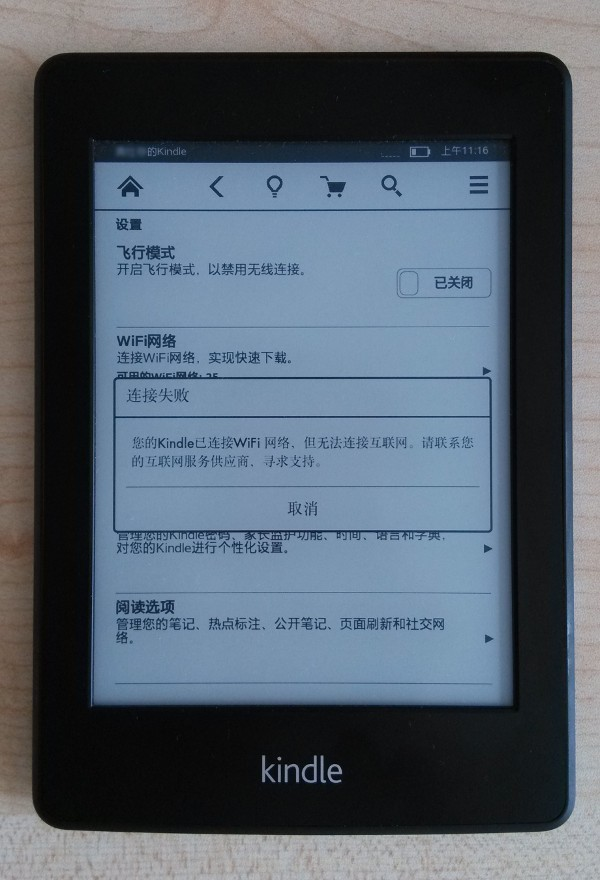

# Kindle已连接WiFi网络，但无法连接互联网的解决办法

---

今天打开kindle准备看《浪潮之巅》，发现没有自动同步我在手机上看的页数，一看是kindle没连上Wi-Fi，然后就主动去连接Wi-Fi。 但连接Wi-Fi后显示** Kindle已连接WiFi网络，但无法连接互联网的解决办法 **  
<!-- more -->

kindle前几天都还可以连网，现在突然突然不行了。不能联网的kindle就没法同步用手机kindle软件看书的进度、并且不能推送电子书了。

看到这报错第一反应是，手机连上Wi-Fi了看能不能联网，后发现手机连上同样的Wi-Fi是可以上网的。感觉不像是家里网络的问题。

想到第一种解决办法是重启kindle（据说重启能解决80%的计算机问题），然后并没什么卵用。

后来上网搜了一下该问题，寻找解决办法。找到了一种可行的解决办法，特此记录一下。

###  解决办法  

> 1、在Kindle U盘根目录建立一个txt文件，名为“WIFI_NO_NET_PROBE”
>
> 2、去掉txt后缀名
>
> 3、然后重启，如此就能避开Kindle连网时的网络验证，可以很顺利地连上WiFi了

