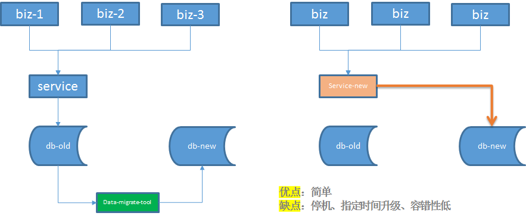
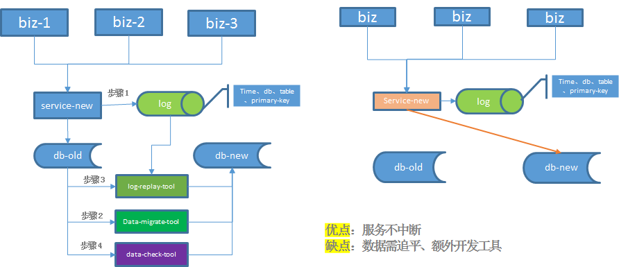
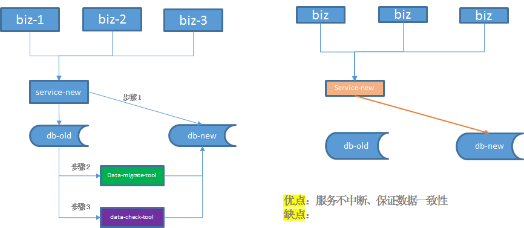

# mysql千万级数据分表迁移方案

# 前言

最近抽空将前段时间负责重构服务迁移数据的项目总结一下。主要涉及mysql分表、数据迁移等方面。由于分库分表面对的场景很多，具体问题具体分析，还是要依据当时项目的实际情况，选择最合理的方案。 

<!-- more -->

# 一、项目背景

近来接手负责一个项目，需要重构业务的实名认证系统。当前该实名认证系统随着业务的增长以及红包活动复用实名认证表，用户实名认证表的数据迅速增长。基于下面几点原因，不得不重构系统，数据分表，迁移数据。

1、由于历史原因，实名认证表是单表，数据量已经达到三千万左右。mysql单表数据量过千万上亿级别就会对服务造成很大的影响。

- 数据库备份，如果单表太大，备份时需要大量的磁盘IO和网络IO 
- 后续很难对该表进行DDL修改 
- 大表会经常访问与更新，就更有可能出现锁等待。将数据切分，用空间换时间，变相降低访问压力）

2、该表主键uid之前是32位，为后续可以扩展，升级为64位，同时新增更新时间字段。
3、当前该服务以及外部服务直接操作数据库表。耦合严重。 

# 二、方案设计 

## 1、数据表怎么切分

数据切分通常分为两种方式：**垂直切分**和**水平切分**

1、**垂直切分**就是根据业务耦合性，将关联度低的不同表存储在不同的数据库。做法与大系统拆分为多个小系统类似，按业务分类进行独立划分。与"微服务治理"的做法相似，每个微服务使用单独的一个数据库。

2、**水平切分**就是将同一个表按不同的条件分散到多个数据库或多个表中，每个表中只包含一部分数据，从而使得单个表的数据量变小。

常见的分片规则：

1、按**时间区间或者id区间**来切分。例如：按日期将不同月甚至是日的数据分散到不同的库中；将userId为1~9999的记录分到第一个库，10000~20000的分到第二个库，以此类推。某种意义上，某些系统中使用的"冷热数据分离"，将一些使用较少的历史数据迁移到其他库中，业务功能上只提供热点数据的查询，也是类似的实践。

**优点：**

- 单表大小可控
- 天然便于水平扩展，后期如果想对整个分片集群扩容时，只需要添加节点即可，无需对其他分片的数据进行迁移
- 使用分片字段进行范围查找时，连续分片可快速定位分片进行快速查询，有效避免跨分片查询的问题。

**缺点：**

- 热点数据成为性能瓶颈。连续分片可能存在数据热点，例如按时间字段分片，有些分片存储最近时间段内的数据，可能会被频繁的读写，而有些分片存储的历史数据，则很少被查询

2、**根据数值取模**。一般采用hash取模mod的切分方式

**优点：**

- 数据分片相对比较均匀，不容易出现热点和并发访问的瓶颈

**缺点：**

- 后期分片集群扩容时，需要迁移旧的数据（使用一致性hash["算法"]能较好的避免这个问题）
- 容易面临跨分片查询的复杂问题。

因为实名认证表没有时间维度字段，主键uid同时也是用户唯一id，由账号系统生成。本次数据表切分最后采用**按用户uid维度取模水平切分**。考虑到后续业务的增长，按uid%100取模，切分成100张表，平均每张表的数量不到百万级别，可支持后续上亿的用户数据。

**优点：**

- 数据均匀分布在100张表中
- 每张表的数据量不会太大   

**缺点：** 

- 一次性增加100张表
- 没法反向关系查询，例如根据手机号查找对应的uid，这个通过在缓存中增加手机号—>uid反向关系解决

## 2、数据怎么迁移

互联网很多“数据量较大，并发量较大，业务复杂度较高”的业务场景，例如在（1）底层表结构变更（2）分库个数变换（3）底层存储介质变换的众多需求下，需要进行数据迁移，如何“平滑迁移数据，迁移过程不停机，保证系统持续服务”。

常见的几种数据迁移方案：

### 1） 停机方案 

优点：停机方案是相对直观和简单的，但对服务的可用性有影响，许多游戏公司的服务器升级，游戏分区与合区，可能会采用类似的方案 

缺点：1、影响服务可用性；2、指定时间内升级 ；3、容错性低，一旦规定时间内升级失败，只能回滚。

### 2) 平滑迁移--追日志法

 
步骤一：服务进行升级，记录“对旧库上的数据修改”的日志，该日志只需记录关键信息
步骤二：研发一个数据迁移工具，进行数据迁移
步骤三：研发一个读取日志并迁移数据的小工具，要把步骤二迁移数据过程中产生的差异数据追平
步骤四：在持续重放日志，追平数据的过程中，研发一个数据校验的小工具，将旧库和新库中的数据进行比对，直到数据完全一致。
数据一直是99.9%的一致，不能完全一致，也是正常的，可以做一个秒级的旧库readonly，等日志重放程序完全追上数据后，再进行切库切流量。

### 3）平滑迁移--双写法 
 

步骤一：服务进行升级，对“对旧库上的数据修改”（这里的修改，为数据的insert, delete, update），在新库上进行相同的修改操作
步骤二：研发一个数据迁移工具，进行数据迁移
步骤三：在数据迁移完成之后，需要使用数据校验的小工具，将旧库和新库中的数据进行比对，完全一致则符合预期，如果出现步骤二中的极限不一致情况，则以旧库中的数据为准。
步骤四：数据完全一致之后，将流量切到新库，完成平滑数据迁移。

 

（1）假设迁移过程中进行了一个双insert操作，旧库新库都插入了数据，数据一致性没有被破坏 

（2）假设迁移过程中进行了一个双delete操作，这又分为两种情况：  

​	（2.1）假设这delete的数据属于[min,now]范围，即已经完成迁移，则旧库新库都删除了数据，数据一致性没有被破坏。

​       （2.2）假设这delete的数据属于[now,max]范围，即未完成迁移，则旧库中删除操作的affect rows为1，新库中删除操作的affect rows为0，但是数据迁移工具在后续数据迁移中，并不会将这条旧库中被删除的数据迁移到新库中，所以数据一致性仍没有被破坏 

（3）假设迁移过程中进行了一个双update操作，可以认为update操作是一个delete加一个insert操作的复合操作，所以数据仍然是一致的 

除非在一种非常非常非常极限的情况下：

（1）date-migrate-tool**刚好**从旧库中将某一条数据X取出

（2）在X插入到新库中之前，旧库与新库中**刚好**对X进行了双delete操作

（3）date-migrate-tool再将X插入到新库中

这样，会出现新库比旧库多出一条数据X。

不管怎样，数据迁移完成之后，在数据迁移完成之后，需要使用数据校验的小工具，将旧库和新库中的数据进行比对，完全一致则符合预期，如果出现步骤二中的极限不一致情况，则以旧库中的数据为准。

此次重构项目中数据分两步迁移完成，数据从老表迁移到新表中。  __在数据校验一致之前，所有的数据均以老表中的数据为准__ 。
因为认证信息表中无法以时间维度来迁移数据，只能通过主键uid导出老表中的数据，然后迁移到新表中。因为数据量接近3000万，所以采用mysql提供的LOAD DATA INFILE导入文件的形式导入数据，这样可大大缩短数据导入时间。LOAD DATA INFILE 语句以很高的速度从一个文本文件中读取行到一个表中。
1、迁移存量数据
为了保证不影响现网服务，读取老表的数据将从从库中读取。为了合理控制迁移数据的时长，并发的select老表的数据，在测试环境测试，迁移3000万的数据大概耗时1小时。 

2、迁移增量数据
 增量数据通过后面数据校验工具对比完成

## 3、怎么保证数据一致性

以 __数据双写服务上线的时间__ 为分割点，分割点之前数据的一致性由数据迁移脚本来保证；分割点以后的数据一致性由新老表双写来保证；当然这些数据的一致性都会有检验机制。 

1、对于数据迁移脚本迁移的数据一致性校验：数据根据uid取模从老表中分别存到100个文本文件中，当数据导入到每张新表后，直接再拉取新表数据到文本中，然后分别校验100个新老文件的MD5值，若都相同，则存量数据一致性没问题。 

2、对于数据库双写保证数据一致性校验：在老表执行成功后才会旁路发hippo（公司内部的消息队列组件）操作新表，hippo消息队列做消息的可靠性保证，新表操作如果失败通过monitor上报告警、error日志记录来保证一致性，如果没有告警和error日志，则可以认为双写数据的一致性。 

3、数据校验工具校验一致性：当存量数据导入新库之后，这是就通过数据校验工具比对新老库数据的一致性。为了不影响现网服务，数据校验比对拉的是老表的从库。当所有数据多次都比对一致后，此时新老库的数据就完全一致。

## 4、怎么保证不影响线上服务

为了不影响实名认证系统及周边业务方的线上服务，此次重构系统分三次迭代上线：

### 1）上线数据库新老表双写

迭代一主要保证新老表数据双写。实名认证老服务在原来写老表操作的地方，旁路一份数据到消息队列中，由新服务消费这个消息队列的消息写入到新表，同时也缓存一份数据到ckv（公司的缓存组件），并且存储由于分表导致无法反向查询手机号->uid的反向关系。旁路消息，异步处理这样不影响到原来的业务流程。

### 2）上线数据同步，保证数据库新老表数据一致

迭代二主要是上线数据同步服务，将老表的存量数据迁移到新表中，并且通过数据校验服务比对新老表数据的一致性。这个过程中，实名认证和业务方仍然使用老表。

### 3）上线切换使用新表、ckv数据，提供新的接口，

迭代三上线切换使用新表，读接口使用ckv缓存数据，写接口先更新数据库再更新缓存，同时也会旁路消息更新老表，老表作为备份。迭代三过程中排查业务方的影响，将分表项目知会到业务方，业务方配合修改自己的逻辑。原有直接访问数据库表的调用一律切换成接口调用。严格控制上线步骤，不影响现网服务。

## 5、为什么选择这个方案

方案初期也考虑了几种方案：

1、引入开源的数据库中间件如mycat、sharding-sphere等。但是引入第三方组件，增加系统复杂度，后续升级发布麻烦，mycat还需额外单独部署机器，增加运维成本。

2、停服迁移数据方案。该方案要停机，这样会影响到用户使用。

综上，最终选择不引入第三方组件，数据双写不停服的方案。

# 三、参考文章

1、[100亿数据平滑数据迁移,不影响服务](<https://www.w3cschool.cn/architectroad/architectroad-data-smooth-migration.html>)

2、[数据库分库分表思路](https://www.cnblogs.com/butterfly100/p/9034281.html)

3、[记一次分库分表——改造策略总结](<https://hanchao.blog.csdn.net/article/details/87093352>)
