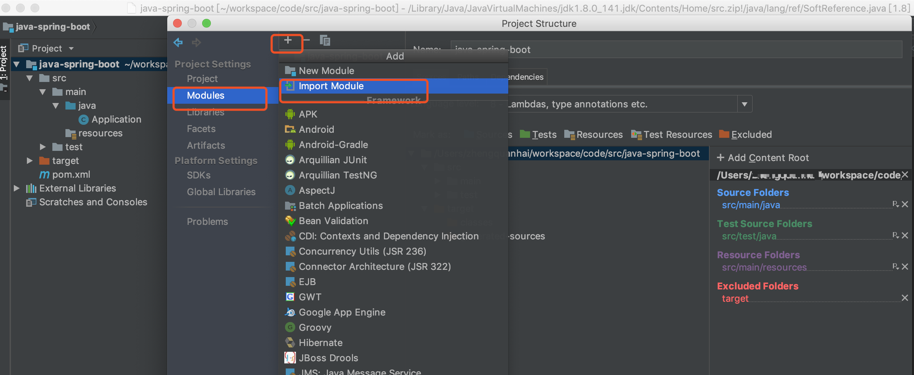

# idea中一个窗口引入多个maven project工程

之前使用eclipse，可以在一个窗口打开多个maven工程。后来换成使用idea，发现idea默认一个窗口打开一个工程project。有时候项目多了，想在一个idea界面打开多个互不相关的maven工程。

<!-- more -->

>在 IntelliJ IDEA 中，没有类似于 Eclipse 工作空间（`Workspace`）的概念，而是提出了`Project`和`Module`这两个概念。  在 IntelliJ IDEA 中Project是最顶级的结构单元，然后就是Module，一个Project可以有多个Module。目前，主流的大型项目结构基本都是多Module的结构，这类项目一般是按功能划分的，比如：user-core-module、user-facade-module和user-hessian-module等等，模块之间彼此可以相互依赖。通过这些Module的命名可以看出，它们都是处于同一个项目中的模块，彼此之间是有着不可分割的业务关系的。
>
>因此，我们可以大致总结出：一个Project是由一个或多个Module组成，尽量让各模块处于同一项目之中，此时彼此之间具有互相依赖的关联关系。在这里，之所以说“尽量”，是因为 IntelliJ IDEA 的Project是一个没有具备任何编码设置、构建等开发功能的，主要起到一个项目定义、范围约束、规范类型的效果，或许，我们也可以简单地**理解Project就是一个单纯的目录**，只是这个目录在命名上必须有其代表性的意义。在一般情况下，IntelliJ IDEA 是默认单Project单Module的，这时Project和Module合二为一，在没有修改存储路径的时候，显然Project对Module具有强约束作用啦！不过说实话，这里就是将Module的内容放在了Project的目录下，实际上还是Module自己约束自己。  
>
>原文：https://blog.csdn.net/qq_35246620/article/details/65448689 

根据上述理解，可以将多个maven工程作为module导入到idea的project中。idea中的project类比eclipse的workspace。idea中的module类比eclipse的project。

1、open多个maven工程所在的目录

2、然后选择要添加的module: File->Project Structure...->Modules可以添加Modules

3、选择maven工程导入，一路确认，最后就成功在idea一个界面导入多个maven工程

这几个maven工程并无相关性，只是为了和eclipse的workspace类比，减少多个工程之间切换idea界面的麻烦。
