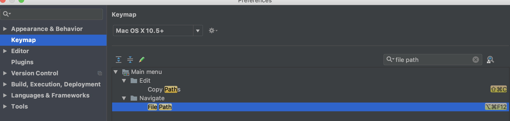

# 在IntelliJ idea中快速打开文件所在的文件夹的解决办法

1、 打开settings设置 

2、 选择keymap

3、 如果是window版本的话，搜索show explorer，右键设置快捷键，通常我设置为Alt + e 键；如果是mac版本的话，搜索file path，默认快捷键是option + command + F12，也可以自己重新定义过一个快捷键，例如：option + E 键。

到此，就可以通过快捷键快速打开文件所在的文件夹了。

**PS：很多快捷键都可以通过keymap找到，如果没有，也可以通过keymap设置。熟练使用快捷键，远离鼠标，效率UP**

