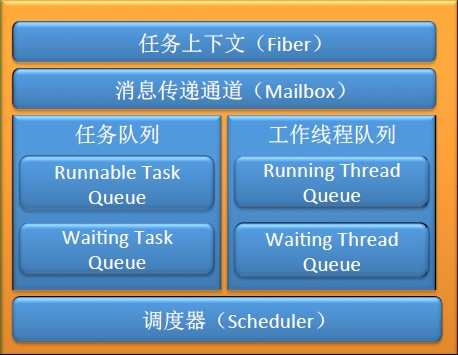
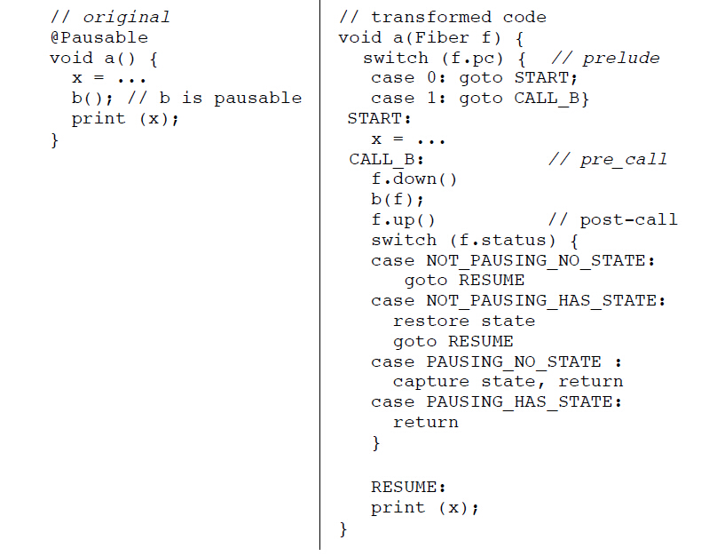

# 浅谈Java协程开源库---kilim


## 0、背景

​    近年来由于一批新兴的语言的流行，存在已久的协程也焕发出新的青春。类似Lua、Go、Phthon等语言都原生支持协程，而传统的C语言中，C标准库里 的函数setjmp和longjmp可以用来实现协程，另外一种广为使用的C语言协程非标准库则是 ucontext组件。由于协程在Java语言层面原生不支持，因此在Java中如果要使用协程，则需要使用第三方的协程框架。Kilim正是这样一个比 较著名的Java 协程开源库。

<!-- more -->

## 1、kilim是什么 

Kilim是一个Java的actor框架，由剑桥的博士sriram srinivasan开发的一个用于在Java中使用Coroutine的框架。它由一个字节码后处理器(“ weaver”)、一个带缓冲邮箱(多生产者、单消费者队列)的运行时库、一个用户级调度器组成。

## 2、Kilim协程框架图 

 Kilim协程框架的整体结构图如下，包括的核心组件：Scheduler协程调度器，WorkerThread工作者线程，Task任务，Mailbox消息邮箱队列，Fiber协程上下文。  



### 1、Task

  Task对象是Kilim中核心的结构，所有业务的逻辑代码都是在Task中执行。Task可以理解为Actor模型中的Actor，Task的执行过程 中可以被暂停，也可以被再次唤醒。使用方式上与Thread 基本类似，启动需要调用Task的start 方法。 

```java
    public Task start() {
        if (scheduler == null) {
            setScheduler(Scheduler.getDefaultScheduler());
        }
        resume();
        return this;
    }
```


### 2、 Scheduler

   Scheduler是Kilim框架中核心的任务调度器，负责管理任务的工作者线程WorkerThread，以及一个基本的FIFO队列，维护着 Task任务列表，Scheduler负责分派Task给指定的工作者线程WorkerThread执行，其实现上类似于ExecutorService 线程池管理Runnable和Callable任务的执行。工作者线程WorkerThread的默认初始化个数为CPU核数，且所有空闲的线程会添加到 RingQueue队列中。 

```java
    public LinkedList<WorkerThread> allThreads = new LinkedList<WorkerThread>();

    public RingQueue<WorkerThread> waitingThreads = new RingQueue<WorkerThread>(10);

    protected volatile boolean shutdown = false;

    public RingQueue<Task> runnableTasks = new RingQueue<Task>(100);
```

### 3、WorkerThread

   WorkerThread是执行任务Task的具体线程，内部维护一个默认大小为10的环形队列RingQueue，与ThreadPoolExecutor线程池中定义的Worker类似，循环阻塞式的从任务队列中获取下一个任务执行。  

```java
RingQueue<Task>  tasks = new RingQueue<Task>(10);

    public void run() {

        try {

            while (true) {

                Task t = getNextTask(this); // blocks until task available

                runningTask = t;

                t._runExecute(this);

                runningTask = null;

            }

        } catch (ShutdownException se) {

            // nothing to do.

        } catch (OutOfMemoryError ex) {

            System.err.println("Out of memory");

        } catch (Throwable ex) {

            ex.printStackTrace();

        }

        runningTask = null;

    }
```

### 4、RingQueue

RingQueue本质上即一个环形队列，作为Queue用于不同的线程之间传递message的设计，和ZeroMQ利用ringbuffer来作为pipe在不同线程之间传递message的用法都是很类似的

```java 
public class RingQueue<T> {
    protected T[] elements;
    protected int iprod;// producer index
    protected int icons;// consumer index
    protected int maxSize;
    protected int size;
```


### 5、 Mailbox

   Kilim 中通过Mailbox 对象来发送消息，Mailbox 的基本原则为可以有多个消息发送者，但只能有一个消息接收者，发送的方式有同步发送、异步发送和阻塞线程方式的同步发送三种：

-  同步发送是指保证一定能将消息放入发送队列中，如当前发送队列已满，则等待到可用为止，阻塞的为当前Task；
- 异步发送则是尝试将消息放入发送队列一次，如果发送失败，则返回false，成功则返回true，不会阻塞Task；
- 阻塞线程方式的同步发送是指阻塞当前线程，并保证将消息发送给接收者。 

```java 
public class Mailbox<T> implements PauseReason, EventPublisher {

    T[] msgs;

    private int iprod = 0; // producer index

    private int icons = 0; // consumer index;

    private int numMsgs = 0;

    private int maxMsgs = 300;

    EventSubscriber sink;
}
```

与发送消息类似，Kilim 中也通过Mailbox 来接收消息，接收方式有同步接收、异步接收以及阻塞线程方式的同步接收三种：

- 同步接收是指阻塞当前Task，直到接收到消息才返回；
- 异步接收是指立刻返回Mailbox 中的消息，有就返回，没有则返回null；
- 阻塞线程方式的同步接收是指阻塞当前线程，直到接收到消息才返回。

### 6、Fiber

  Fiber的概念可能稍微难以理解，Kilim中的Fiber对象主要用来维护Task执行过程中的堆栈，Fiber中的主要成员变量有 curState，pc，stateStack，iStack等，其中curState为当前协程的执行状态，stateStack为协程的堆 栈，iStack表示当前的栈帧位置。 

```java 
public final class Fiber {

    public State               curState;

    public int                 pc;

    /*
     * One State object for each activation frame in the call hierarchy.
     */
    private State[]            stateStack              = new State[10];

    /*
     * Index into stateStack and equal to depth of call hierarchy - 1
     */
    private int                iStack                  = -1;

    /*
     * The task to which this Fiber belongs
     */
    public Task                      task;
}
```

## 3、kilim的调度流程

调度流程中有三个主要的类

- Scheduler-调度器
- WorkThread-调度运行承载线程
- Task-类似于Thread，协程的体现者


## 4、Kilim要解决的问题 

Kilim协程框架中最核心需要解决的问题

1. **如何暂停处理当前任务，转而处理其他任务？**
2. **如何恢复任务继续执行？**

也即如何实现协程本身的 yield / resume的语义特性。 

### Kilim的解决方案

   Kilim框架在实现yield / resume的语义特性时，主要做以下几个事情：

- 利用字节码技术(基于ASM字节码框架)，将普通代码转化为支持协程的代码；
- 调用Pauseable方法的时候，如果方法暂停了就保存当前方法的堆栈，暂停执行当前Task，将控制权交给Scheduler调度器；
- Scheduler调度器负责协调其他就绪的Task；
- 之前暂停的Task恢复的时候，自动恢复对应方法的堆栈，恢复到上次执行的位置继续执行；

​    其中，第一点是在编译期实现，后面三点是在运行期执行。再稍微详细一点就是：Kilim通过编译期字节码编织，对每一个可暂停（Pauseable）的方 法进行字节码处理，在方法执行前和执行后加上相关的执行上下文的处理，暂停时会保存执行堆栈，然后通过特定的字节码跳转指令goto跳转到另外一个 Task的执行方法中，恢复时将复原整个线程堆栈，回到上次暂停时的位置继续往下执行。

## 5、Kilim的工作原理 

 Kilim最神奇的地方在于字节码增加，那么它是怎样将普通的Java代码改写层支持协程的代码呢？首先上Kilim官方文档中的一张图：



这张图也即Kilim实现协程语义的精髓所在，和C语言中实现协程的方式有很大不同，接下来仔细分析。

​    左边是普通的Java函数代码，与我们常见的函数唯一有所不同的是函数a和b均显示声明抛出Pausable异常，而实际上这个异常在运行期间不会抛出， 它的实际作用类似于注解，使得Kilim能够识别哪些代码需要Weaver工具进行代码增强。函数抛出Pausable异常即表明该函数是可暂停的，

   右边的代码即通过字节码增强后的代码，与左边原始的代码相比，首先函数声明中额外增加了一个Fiber参数，Fiber可以理解为当前纤程、协程的上下 文。Fiber中存储着协程暂停和恢复时需要用到的函数堆栈、程序计数器以及当前函数的执行状态。字节码增强后的代码以调用Pausable方法a为分 界，将整个函数分成几个代码块，也即官网文档中提及的prelude、pre_call、post_call三部分。

- 在prelude块中，也即刚进入函数a时将会执行的代码块，将根据Fiber中的pc程序计数器跳转到对应的代码块处开始执行。
- 在pre_call块中，也即在调用函数b之前，将调用Fiber的down方法记录当前执行状态和pc程序计数器，标识着函数将进入下一个Pausable方法。
- 在post_call块中，也即在调用函数b之后，将调用Fiber的up方法计算函数b调用完成后返回的状态，标识着从一个被调的Pausable方法返回，它既可能是正常的函数b执行完成返回，也可能是函数b执行暂停返回，接着通过这个状态控制后续的执行流程。

这四种状态分别为：

1. NOT_PAUSING__NO_STATE，即被调函数执行完成正常返回，这种情况与即普通的函数执行类似。
2. NOT_PAUSING__HAS_STATE，即被调函数执行完成，但还存在上次暂存的栈帧，这种情况一般是函数从上次暂停处恢复执行，且顺利执行完成返回，此时需要恢复函数的栈帧，然后goto到RESUME代码块继续执行。
3. PAUSING__NO_STATE，即被调函数执行过程中暂停，且还未保存函数栈帧，需要主调函数执行暂存操作，这种情况一般即第一次协程执行到需要暂停处，此时需要采用字节码暂存函数的栈帧和状态，然后直接return。
4. PAUSING__HAS_STATE， 即被调函数执行过程中暂停，且已经保存函数栈帧，这种情况是该Pausable从上次暂停处恢复执行，但是依然没有预期的结果，需要再次暂停，此时因为之 前暂停时函数栈帧和状态都已经保存过，不需要再做什么，因此直接return即可。

​    OK，到目前为止基本原理大概清晰，不过要把协程与线程的执行过程整个串联起来，形成一个整体还稍显迷惑，接下来详细说明。

   上面已经提到协程执行过程中核心的两个点：一点是调用Pauseable方法的时候，如果暂停了就保存当前方法栈的State，暂停执行当前Task，将 控制权交给Scheduler调度器，另外一点是暂停的Task恢复的时候，自动恢复State，恢复到上次执行的位置继续执行。这两点的具体过程如下：

   前面的Kilim结构图中已经讲到Kilim中有几个核心元素，包括Task、Scheduler、WorkerThread以及Mailbox。其中 WorkerThread即实际执行Task任务的工作者线程，Task即具体的可暂停的业务逻辑，Task与Task之间通过参数化定制的 Mailbox来通信。Kilim将线程run方法体中所有嵌套层级调用的所有Pausable方法组织成一个具有父子关系的调用链，形如 run->A->B->C，通过Task私有的Fiber来记录执行到哪一个层级。通常Kilim中使用Mailbox提供的get、 getb、getnb三个不同版本来接收消息，其中最常用的get会阻塞当前Task而不阻塞当前线程。

### **如何实现Task的暂停？**

   例如一个运行状态Task的调用链run->A->B->C，其中A、B、C均为Pauseable方法，在函数C中调用了 Mailbox的get方法且设置了超时时长，当整个链嵌套执行到C的get方法这一行时，因为get本身也是一个Pausable方法，如果没有接收到 消息，将会把Task作为该Mailbox的观察者，并调用Task.pause(this)方法暂停自身，然后该get方法即直接返回，get调用返回 后，C根据Fiber的up计算发现是暂停返回，则也暂停本函数，暂存栈帧和状态，直接返回，如此逆向直到run方法，从而实现Task的暂停。

```java 
 public T get() throws Pausable{

        Task t = Task.getCurrentTask();

        T msg = get(t);

        while (msg == null) {

            Task.pause(this);

            removeMsgAvailableListener(t);

            msg = get(t);

        }

        return msg;

    }
```

### 如何实现Task的恢复呢？

Task暂停的过程中有一步很关键，将该Task作为该Mailbox的观察者，在当有其他线程把消息通过调用Mailbox的put方法添加到Mailbox中时，或者超时定时器触发时，将会回调该Mailbox的观察者，告诉观察者有新的消息到来。这样Task的onEvent被回调，onEvent直接调用resume方法，而resume方法实际最重要的一步即调用Scheduler的schedule方法，将该Task加入到Scheduler的可运行任务队列中，并随机选择一个等待运行的工作者线程，并notify该线程，该线程被唤醒后将执行该Task，重复之前的函数调用链run->A->B->C执行，由于A、B、C三个函数中均已经保存了之前暂停的函数栈帧和状态，因此之前已经执行过的代码块将不会重复执行，会根据Fiber中状态选择性的执行对应的代码块。因为Mailbox中已经有消息，因此再重复执行到get方法时能够直接获取到消息，正常的往下继续执行。这样相当于又走了一次调用链，但是并非重复执行已经执行过的代码，而是恢复执行之前未执行的代码，从而实现Task的恢复


```java
public void onEvent(EventPublisher ep, Event e) {
        resume();
    }
```


