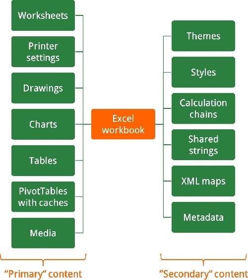
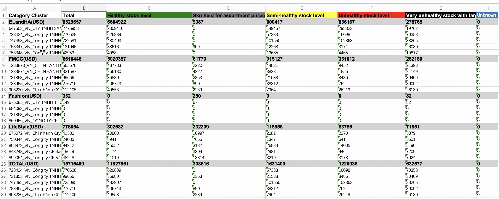
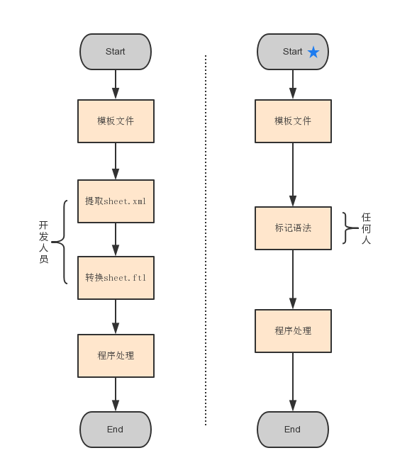
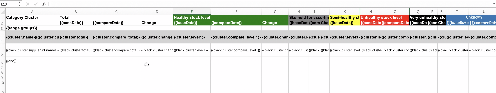
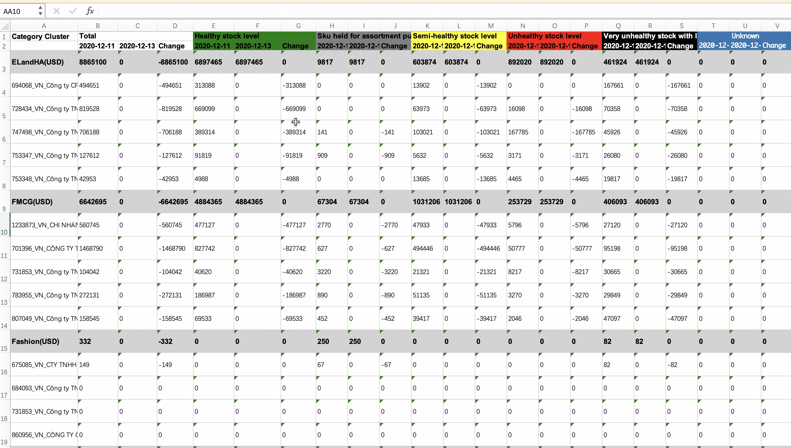

# 巧用模版导出复杂excel

本文主要介绍总结用golang、模版实现导出复杂excel表格
<!--more-->


## 背景

由于东南亚业务的特殊情况，在供应链的业务系统中，经常需要支持业务数据的excel导出。因为供应链业务数据复杂、数据量大，业务方经常希望开发能够支持生成样式定制、多个sheet、展示图表的excel，便于用户查看excel数据。  

## 方案分析

对于简单的excel生成导出，绝大部分语言都提供了方便的类库API操作。类似于python的**xlutils**、**xlsxwriter**等，go里的 [tealeg/xlsx](https://github.com/tealeg/xlsx) 、[excelize](https://github.com/360EntSecGroup-Skylar/excelize) 等。  

那么对于复杂的excel生成导出，如果不用api操作的话，是否还有别的方法实现呢？  

在此之前，需要了解 Excel xlsx 格式的文件结构，Excel 文件使用 OOXML（Open Office XML）文件格式，这是微软为 Office 2007 产品开发的技术规范，一个开放文档格式标准。Excel 以熟悉的 XML 为存储语言，了解内部结构有助于对 xlsx 进行深度定制，下图是一个较为全面的 Excel 元素集合。




xlsx 文件实际上是一个压缩的 XML 文件集合，包含元数据、媒体和图片等文件，开发者可以方便地查看和编辑 Excel 工作簿的结构内容，我们把它看做 zip 压缩包，通过 `unzip` 命令解压得到如下内容：

```
Archive:  template.xlsx
 ----------------------------------------------
├── [Content_Types].xml -------- 内容类型
├── _rels
│   └── .rels ----------------- 关系配置
├── docProps
│   ├── app.xml --------------- 扩展属性
│   └── core.xml -------------- 核心属性
└── xl ------------------------- Excel 实际内容
    ├── _rels
    │   └── workbook.xml.rels
    ├── sharedStrings.xml ------ 内容数据库
    ├── styles.xml ------------- 单元格样式
    ├── theme
    │   └── theme1.xml -------- 主题样式
    ├── workbook.xml ----------- 工作表
    └── worksheets
        ├── sheet1.xml --------- 第一个工作表
        └── sheet2.xml --------- 第二个工作表
```

所以从xlsx的结构看，我们可以通过模版替换生成来生成复杂的excel。

## 实现思路

**基于模版生成导出excel**。根据xlsx的结构看，理论上可以通过定义xlsx的模版，渲染业务数据，就能生成业务excel。

### python实现方法

python的实现思路是先定义好xml模版，提取对应的sheet.xml，然后通过django template模块渲染替换，生成导出excel表格。

Microsoft提供了文档说明如何定义excel 的xml模版去创建excel表格，详细文档：[generate_excel_xml](https://docs.microsoft.com/en-us/archive/blogs/brian_jones/introduction-to-excel-xml-part-1-creating-a-simple-table) ，下面简解释下xml模版的基本要素。   

####  1、xml模版

- XML声明  
  -  XML 1.0 版本，根元素\<Workbook>
- 声明namespace和前缀 
  - <ss:Workbook xmlns:ss="urn:schemas-microsoft-com office:spreadsheet">
- 添加sheet和table
  - \<Worksheet> 和 \<Table>
- 添加header信息和固定数据信息
  - \<Row> \<Cell> \<Data>
- 样式调整
  - \<Styles> 配置
- 动态传入数据
  - XSLT或者Django template传入

xml样例

```xml
<?xml version="1.0"?>

<!--
    For full Microsoft Office xml spreadsheet, please visit:
    https://docs.microsoft.com/en-us/previous-versions/office/developer/office-xp/aa140066(v=office.10)
-->
<ss:Workbook xmlns:ss="urn:schemas-microsoft-com:office:spreadsheet">
    <!-- 样式表 -->
    <ss:Styles>
        <ss:Style ss:ID="NormalHeader">
            <ss:Font ss:Bold="1" ss:Size="13" />
        </ss:Style>
        <ss:Style ss:ID="CategoryCluster1stLine">
            <ss:Font ss:Bold="1" ss:Size="13" />
            <ss:Interior ss:Color="lightgray" ss:Pattern="Solid" />
        </ss:Style>
        <ss:Style ss:ID="InventoryHealthLevel1Title">
            <ss:Font ss:Bold="1" ss:Size="13" ss:Color="white" />
            <ss:Interior ss:Color="green" ss:Pattern="Solid" />
        </ss:Style>
    </ss:Styles>
    <ss:Worksheet ss:Name="Inventory Health Dashboard">
        <ss:Table ss:DefaultColumnWidth="200">
            <!-- 第一行标题 -->
            <ss:Row>
                <ss:Cell ss:StyleID="NormalHeader">
                    <ss:Data ss:Type="String">Category Cluster</ss:Data>
                </ss:Cell>
                <ss:Cell ss:StyleID="NormalHeader">
                    <ss:Data ss:Type="String">Total</ss:Data>
                </ss:Cell>
                <ss:Cell ss:StyleID="InventoryHealthLevel1Title">
                    <ss:Data ss:Type="String">Healthy stock level</ss:Data>
                </ss:Cell>
                
                    <ss:Cell ss:StyleID="InventoryHealthLevelUnknownTitle">
                        <ss:Data ss:Type="String">Unknown</ss:Data>
                    </ss:Cell>
                
            </ss:Row>
            
                <ss:Row ss:StyleID="CategoryCluster1stLine">
                    <ss:Cell>
                        <ss:Data ss:Type="String">{{cluster}}({{export_options.currency}})</ss:Data>
                    </ss:Cell>
                    
                    
                        
                    
                </ss:Row>
                
                    
                        
                            <ss:Row>
                                <ss:Cell>
                                    <ss:Data ss:Type="String">{{supplier_id_name}}</ss:Data>
                                </ss:Cell>
                                
                                
                                    
                                
                            </ss:Row>
                        
                    
                
            
        </ss:Table>
    </ss:Worksheet>
</ss:Workbook>
```


#### 2、代码demo

在根据样式定义好模版文件，定义好xml后，通过django的template渲染输入数据，生成excel数据流。代码demo如下面所示：  

```python
from django import template

register = template.Library()

@register.tag(name="extract_single_stats")
def extract_single_stats(parser, token):
    """
    用于在模板上从指定的统计树中获取指定节点的单天的数值
    https://docs.djangoproject.com/en/1.7/howto/custom-template-tags/#writing-the-compilation-function

    模板中使用语法 
    其中 path_node 支持加载变量，通过 var: 前缀声明
        
    如果 path_node 需要 hard code，直接写明值，不需要 var: 前缀：
        
    """
    tag_name, context_key, base_date = token.split_contents()[0:3]
    path_nodes = token.split_contents()[3:]
    return StatsExtractionNode(context_key, base_date, None, path_nodes)
```

#### 3、导出效果

经过渲染之后，最终生成复杂样式的excel表格。

python用xml模版生成excel表格的方法虽然支持各种丰富的格式，兼容性高，但是这种方法有一定的学习成本，需要了解excel的xml定义，同时也依赖django的实现。那有没有更简单、更通用的方法来生成样式多变的excel呢？

答案是：有的。**采用go语言的方法可以更简单、更通用的来生成excel**。   

### go实现方法

在 Excel 文档中设置标记语法，可视化编辑，通过代码逻辑实现模板转换、生成和替换，完成内容渲染和导出。一切都交给代码。整体如下面图右所示： 



用户只需创建一个excel表格，根据简单的语法编辑，然后经过程序处理，就能完成内容渲染和导出。模版语法类似于freemarker语法，简单明了。

####  1、模版demo


如图所示，{{}}作为语法标识，可以在模版中任意地方出现。模版语法类似于freemarker语法

| 语法                    | 实例                    | 说明                                                         |
| ----------------------- | ----------------------- | ------------------------------------------------------------ |
| \{ \{xxx\} \}                 | \{ \{baseDate\} \}            | 字符串、数值等                                               |
| \{ \{xxx.xxx\} \}             | \{ \{cluster.name\} \}        | 对象属性值                                                   |
| \{ \{range.group\} \} \{ \{end\} \} | \{ \{range.group\} \} \{ \{end\} \} | 循环取值<br />1 、\{ \{range.group\} \}循环开始  <br />2、\{ \{end\} \} 循环结束 |

#### 2、代码demo

先准备待渲染的数据，然后读模版、渲染数据，导出即可。只需简单几行代码就搞定。

```go
import "github.com/ivahaev/go-xlsx-templater"

// 1、Prepare context data
	groups := make([]map[string]interface{}, 0)
	for _, key := range keys {
		item := make(map[string]interface{}, 0)
		item["cluster"] = clusters[key]
		for k, v := range topSuppliers {
			if k == key {
				item["black_cluster"] = v
				break
			}
		}
		groups = append(groups, item)
	}

	ctx := map[string]interface{}{
		"groups": groups,
	}
	if CompareDate != "" {
		ctx["baseDate"] = req.BaseDate
		ctx["compareDate"] = req.CompareDate
	}

// 2、Read template, render with context and save to disk.
doc := xlst.New()
	doc.ReadTemplate("./template.xlsx")
	doc.Render(ctx)
	doc.Save("./report.xlsx")
```

####  3、导出效果

导出效果和python的方法一模一样.

## 小结

在处理简单excel，简单表头、单一样式，各个语言都有简单方便的api库供开发者使用。但是在处理复杂excel时，简单的api操作实现困难，代码冗长，并且没有一定的通用性。  

本文介绍了通过模版方法，定制样式复杂、通用的excel生成导出方法。go和python两种实现方式，对比之下，python稍显复杂，go通过excel模版定义样式，可视化编辑，更为简单易用。

通过模版方法，从用户的角度出发，在 Excel 文档中设置标记语法，可视化编辑，通过代码逻辑实现模板转换、生成和替换，完成内容渲染和导出。一切交给程序，一切那么简单，不管产品提出多复杂的excel导出，再也不用因此加班了：）

## 进一步思考  

考虑到大部分业务需要导出excel的需求，后续可以构建一个基于模版生成excel的服务，业务开发同学作为用户只需上传一个excel模版，然后调用excel服务就能生成excel，无需再关心excel如何生成，专注于业务开发，提升业务开发效率。

## 参考资料

[https://github.com/tealeg/xlsx](https://github.com/tealeg/xlsx)

[https://github.com/ivahaev/go-xlsx-templater](https://github.com/ivahaev/go-xlsx-templater)

[https://docs.djangoproject.com/en/3.0/topics/templates/](https://docs.djangoproject.com/en/3.0/topics/templates/)

[generate_excel_xml](https://docs.microsoft.com/en-us/archive/blogs/brian_jones/introduction-to-excel-xml-part-1-creating-a-simple-table)
